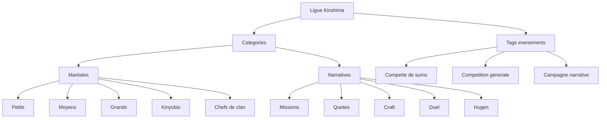

# LIGUE KINSHIMA

## Tableau des Scores des Clans

  
  
  
  
  
  

  Classements, progression des points, historique officiel des affrontements et panneau d'administration.

  Site en ligne: <a href="http://kinshima.duckdns.org:8080/">http://kinshima.duckdns.org:8080/</a>

---

## Apercu

- Page publique `index.html`:
  - classement par saison
  - filtres principaux: saison, categorie, tag
  - visualisation des points
  - historique filtrable
- Page admin `admin.html`:
  - saisie des resultats
  - conservation des parametres de la derniere saisie (saison/clan/categorie/tag)
  - gestion des clans, categories et tags
  - gestion individuelle des resultats (modifier/supprimer)
  - pagination des resultats
  - export CSV (Excel compatible)

---

## Structure Categories / Tags

- `Categorie martiale`:
  - `Petits`
  - `Moyens`
  - `Grands`
  - `Kinyobis`
  - `Chefs de clan`
- `Categorie narrative`:
  - `Missions`
  - `Quetes`
  - `Craft`
  - `Duel`
  - `Hugen`
- `Tags d'evenement` (exemples):
  - `Compette de sumo`
  - `Competition generale`
  - `Campagne narrative`
  - `Tournoi interne`

Schema Mermaid (compatible GitHub):

---

---

## Stack et Donnees

- UI: `HTML`, `CSS`, `JavaScript` vanilla
- Base centralisee SQL: `SQLite` (`data/kinshima.sqlite` via `src/server.js`)
- Config applicative (hors resultats): `localStorage`
  - clans
  - categories
  - tags
  - styles visuels des clans

---

## Structure

- `src/`: backend (config, db, services, routes, serveur)
- `public/index.html`: vue publique
- `public/admin.html`: panneau admin
- `public/css/styles.css`: theme Kinshima (nuit / royal / or)
- `public/js/script.js`: logique metier et UI
- `public/js/db.js`: persistence front (IndexedDB + fallback)
- `public/logos/`: logos des clans
- `scripts/`: scripts superviseur et installation systemd

---

## Securite Admin

- Mot de passe initial: `Kinshima-Admin-2026`
- Blocage anti brute-force: `5` erreurs consecutives => blocage `5` minutes

---

## Demarrage

Mode local sans API (donnees locales uniquement):

1. Ouvrir `public/index.html`.
2. Aller sur `public/admin.html` via le lien en bas de page pour la gestion.

Mode partage multi-utilisateurs (recommande):

1. Lancer le serveur Node:
   - `npm install`
  - `npm start`
2. Ouvrir:
   - `http://localhost:3000/`
3. Tous les utilisateurs doivent passer par le meme serveur (meme URL/host).
4. Migration auto:
   - au premier demarrage, si `data/shared-state.json` existe, les donnees sont migrees vers SQLite.

Mode "reste actif" (superviseur, Windows):

1. Double-cliquer `start-server.cmd`
  - ou lancer `powershell -ExecutionPolicy Bypass -File .\scripts\start-server.ps1`
2. Le script redemarre automatiquement `src/server.js` si Node plante.
3. Tant que cette session est ouverte, le serveur web et l'API restent en ligne ensemble.

Mode "serveur Linux / Raspberry Pi" (recommande en production):

1. Rendre executables les scripts:
  - `chmod +x scripts/start-server.sh scripts/install-systemd.sh`
2. Tester le mode supervise local Linux:
  - `./scripts/start-server.sh`
3. Installer comme service systemd (auto demarrage au boot + restart auto):
  - `sudo ./scripts/install-systemd.sh`
4. Verifier le service:
   - `sudo systemctl status kinshima.service`
5. Voir les logs:
   - `sudo journalctl -u kinshima.service -f`

Mise a jour serveur Linux:

1. `cd /var/www/kinshima`
2. `sudo git pull`
3. `sudo systemctl restart kinshima.service`

---

## Export CSV

Depuis le panneau admin:

- ouvrir `Gestion des resultats individuels`
- cliquer `Exporter CSV`
- ouvrir le fichier telecharge dans Excel ou LibreOffice

Colonnes exportees:

- `id`
- `occurredAt`
- `season`
- `team`
- `category`
- `tag`
- `score`
- `note`

## Import CSV (version rapide)

Depuis le panneau admin:

- cliquer `Importer CSV`
- selectionner un fichier CSV au format exporte par le site
- choisir le mode:
  - `Fusionner`: ajoute/met a jour sans tout effacer
  - `Remplacer`: ecrase les resultats actuels
- si la colonne `tag` est absente, le tag par defaut est applique automatiquement

Utilisation recommandee:

- exporter un CSV avant update
- deployer la nouvelle version
- importer le CSV pour restaurer les resultats

## Persistance du mot de passe admin

- Le mot de passe admin est conserve dans:
  - `localStorage` (fallback)
  - IndexedDB (`kinshima-results-db` / store `settings`) pour une meilleure resilience apres mise a jour
- Synchronisation globale (tous les utilisateurs):
  - le front tente `GET/PUT /api/admin-password`
  - format attendu: `{ "password": "votre-mot-de-passe" }`
  - si l'API n'existe pas, la mise a jour reste locale au navigateur

## API multi-utilisateurs

Le repo inclut un backend `src/server.js` (Node natif + SQLite) avec:

- `GET /api/results`
  - retourne: `{ "entries": [...], "teams": [...], "categories": [...], "tags": [...], "teamStyles": {...}, "revision": 12, "updatedAt": "2026-03-05T12:00:00.000Z" }`
- `PUT /api/results`
  - accepte les memes champs pour synchroniser scores + taxonomie globale
  - accepte aussi `revision` (optimistic locking)
  - en cas de conflit de revision: `409 { "error": "revision-conflict", "currentRevision": ... }`
- `GET /api/admin-password`
  - retourne: `{ "password": "..." }`
- `PUT /api/admin-password`
  - accepte: `{ "password": "...", "currentPassword": "..." }`
  - `currentPassword` est optionnel (recommande pour verification cote serveur)

Stockage serveur:

- fichier SQL: `data/kinshima.sqlite`
- migration auto depuis `data/shared-state.json` au premier demarrage
- transactions SQLite + controle `revision` pour eviter les collisions inter-instances

## Hardening backend (passe 2)

Variables d'environnement disponibles:

- `MAX_BODY_BYTES` (defaut: `2097152`)
- `RATE_LIMIT_WINDOW_MS` (defaut: `60000`)
- `MAX_WRITE_REQUESTS_PER_WINDOW` (defaut: `30`)
- `ENABLE_REQUEST_LOGS` (`true` par defaut)
- `ACCESS_CONTROL_ALLOW_ORIGIN` (defaut: `*`)
- `ENFORCE_ADMIN_WRITE_AUTH` (`false` par defaut)

Quand `ENFORCE_ADMIN_WRITE_AUTH=true`, les requetes d'ecriture `PUT /api/results` et `PUT /api/admin-password` doivent fournir le mot de passe admin via:

- header `X-Admin-Password: <mot_de_passe>`
- ou header `Authorization: Bearer <mot_de_passe>`

---

Copyright Kinshima 2026
