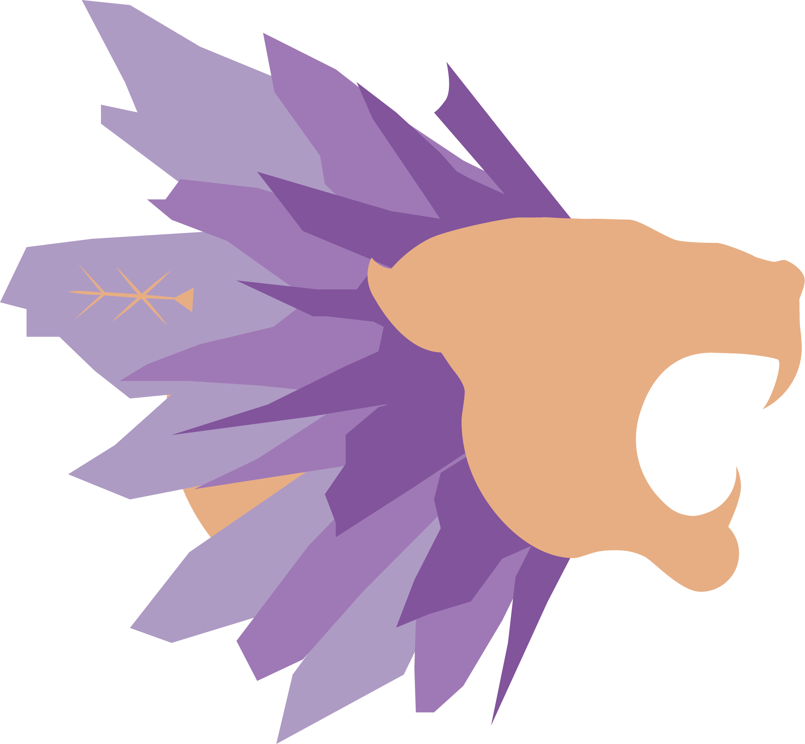
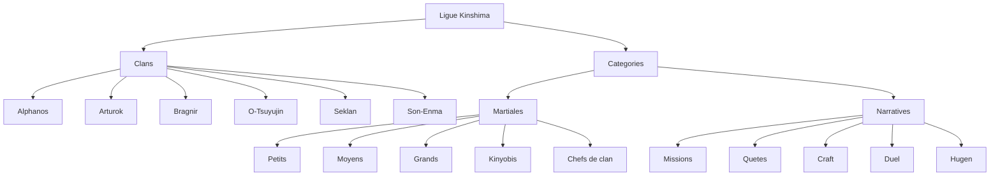

# LIGUE KINSHIMA

## Tableau des Scores des Clans

  
  
  
  
  
  

  Classements, progression des points, historique officiel des affrontements et panneau d'administration.

  Site en ligne: <a href="http://kinshima.duckdns.org:8080/">http://kinshima.duckdns.org:8080/</a>

---

## Apercu

- Page publique `index.html`:
  - classement par saison
  - visualisation des points
  - historique filtrable
- Page admin `admin.html`:
  - saisie des resultats
  - gestion des clans et categories
  - gestion individuelle des resultats (modifier/supprimer)
  - pagination des resultats
  - export CSV (Excel compatible)

---

## Structure Clans / Categories / Sous-categories

- `Clan`: une equipe (ex: Alphanos, Arturok, Bragnir, O-Tsuyujin, Seklan, Son-Enma)
- `Categorie martiale`:
  - `Petits`
  - `Moyens`
  - `Grands`
  - `Kinyobis`
  - `Chefs de clan`
- `Categorie narrative`:
  - `Missions`
  - `Quetes`
  - `Craft`
  - `Duel`
  - `Hugen`

Schema Mermaid (compatible GitHub):

---

---

## Stack et Donnees

- UI: `HTML`, `CSS`, `JavaScript` vanilla
- Resultats: `IndexedDB` via `db.js`
  - base: `kinshima-results-db`
  - store: `results`
- Config applicative (hors resultats): `localStorage`

---

## Structure

- `index.html`: vue publique
- `admin.html`: panneau admin
- `styles.css`: theme Kinshima (nuit / royal / or)
- `script.js`: logique metier et UI
- `db.js`: persistence des resultats
- `logos/`: logos des clans

---

## Securite Admin

- Mot de passe initial: `Kinshima-Admin-2026`
- Blocage anti brute-force: `5` erreurs consecutives => blocage `5` minutes

---

## Demarrage

1. Ouvrir `index.html`.
2. Aller sur `admin.html` via le lien en bas de page pour la gestion.

- `cd /var/www/kinshima`
- `sudo git pull`

---

## Export CSV

Depuis le panneau admin:

- ouvrir `Gestion des resultats individuels`
- cliquer `Exporter CSV`
- ouvrir le fichier telecharge dans Excel ou LibreOffice

## Import CSV (version rapide)

Depuis le panneau admin:

- cliquer `Importer CSV`
- selectionner un fichier CSV au format exporte par le site
- choisir le mode:
  - `Fusionner`: ajoute/met a jour sans tout effacer
  - `Remplacer`: ecrase les resultats actuels

Utilisation recommandee:

- exporter un CSV avant update
- deployer la nouvelle version
- importer le CSV pour restaurer les resultats

## Persistance du mot de passe admin

- Le mot de passe admin est conserve dans:
  - `localStorage` (fallback)
  - IndexedDB (`kinshima-results-db` / store `settings`) pour une meilleure resilience apres mise a jour
- Synchronisation globale (tous les utilisateurs):
  - le front tente `GET/PUT /api/admin-password`
  - format attendu: `{ "password": "votre-mot-de-passe" }`
  - si l'API n'existe pas, la mise a jour reste locale au navigateur

---

Copyright Kinshima 2026
